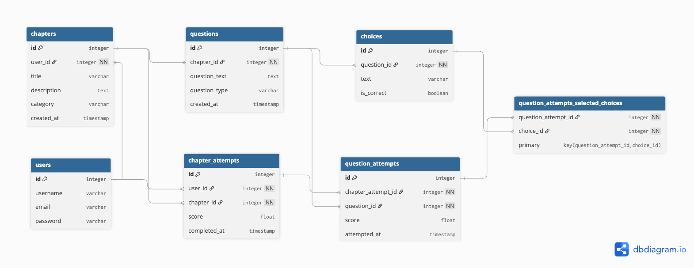

# TestMeGemini

Turn your notes into interactive quizzes and track your learning progress.

## Features

- **User Authentication**  
  Secure authentication with **JWT tokens** and **email login**, ensuring safe access to your account.

- **Upload Notes & Auto-Generate Questions**  
  Upload your study notes in **PDF Format** and automatically generate questions in multiple formats:
    - **MCQ (Multiple Choice Questions)**
    - **MRQ (Multiple Response Questions)**
    - **True/False**

- **Create Chapters and Questions**  
  Organize your content efficiently by creating chapters and questions for quizzes and study material.

- **Take Quizzes & Track Attempts**  
  Test your knowledge with interactive quizzes. Review answers, monitor progress, and analyze performance over multiple attempts.

- **Dashboard with Analytics and Charts**  
  Gain insights into your learning progress through detailed analytics, including charts and performance metrics.

## Upcoming Features

- Support for deleting chapters, including both hard and soft delete options.
- An Analytics page for detailed insights and reporting.
- Asynchronous chapter and question generation powered by Celery for improved performance.

## Screenshots


## Installation

### Environment Variables
- Backend: Set `GEMINI_API_KEY` to your Gemini API Key
- Frontend: Set `NEXT_PUBLIC_API_URL` to your API Key

### Backend (Django)

```bash
cd backend
python -m venv venv
source venv/bin/activate
pip install -r requirements.txt
python manage.py migrate
python manage.py runserver
```

### Frontend (Next.js)

```bash
cd frontend
npm install
npm run dev
```

## Architecture Overview
- **Architecture:** Single Page Application
- **Backend:** Django REST Framework, JWT Auth, OpenAI integration for question generation.
- **Frontend:** Next.js (App Router), React, Tailwind CSS, shadcn/ui, Recharts for charts.
- **Database:** SQLite (default, can be swapped for Postgres/MySQL)
- **Database Modelling**: 


## Model Choice & Cost Comparison

This project currently uses **Google Gemini 2.5 Flash** (`gemini-2.5-flash`) for question and quiz generation.
I also considered **OpenAI GPT-4o Mini** (`gpt-4o-mini`) as an alternative. Here’s a quick comparison:

| Model             | Input Token Price* | Output Token Price* | Max Context | Speed      | Notes                        |
|-------------------|-------------------|---------------------|-------------|------------|------------------------------|
| gemini-2.5-flash  | ~$0.35 / 1M       | ~$1.05 / 1M         | 1M tokens   | Very fast  | Lower cost, good for bulk    |
| gpt-4o-mini       | $0.50 / 1M        | $1.50 / 1M          | 128k tokens | Fast       | Slightly higher quality      |

\*Prices as of August 2025. See [OpenAI Pricing](https://openai.com/pricing) and [Gemini Pricing](https://ai.google.dev/pricing).

- **Gemini 2.5 Flash** is currently used for its lower cost and high speed, making it ideal for generating many questions quickly.
- **GPT-4o Mini** offers slightly higher quality and more context, but at a higher price per token.

You can easily switch between models in `backend/api/utils/ai.py` by calling either `call_gemini_model` or `call_gpt_model`.

## License

MIT
