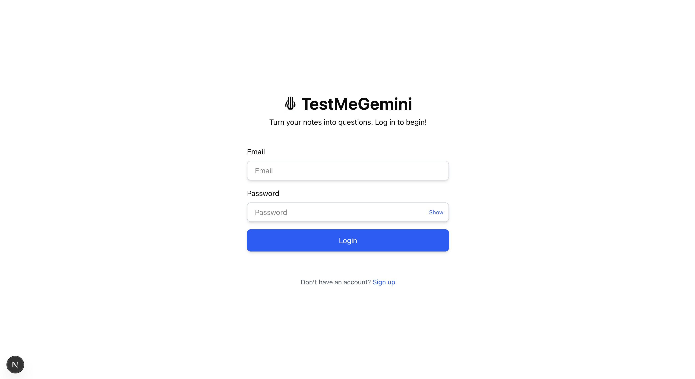
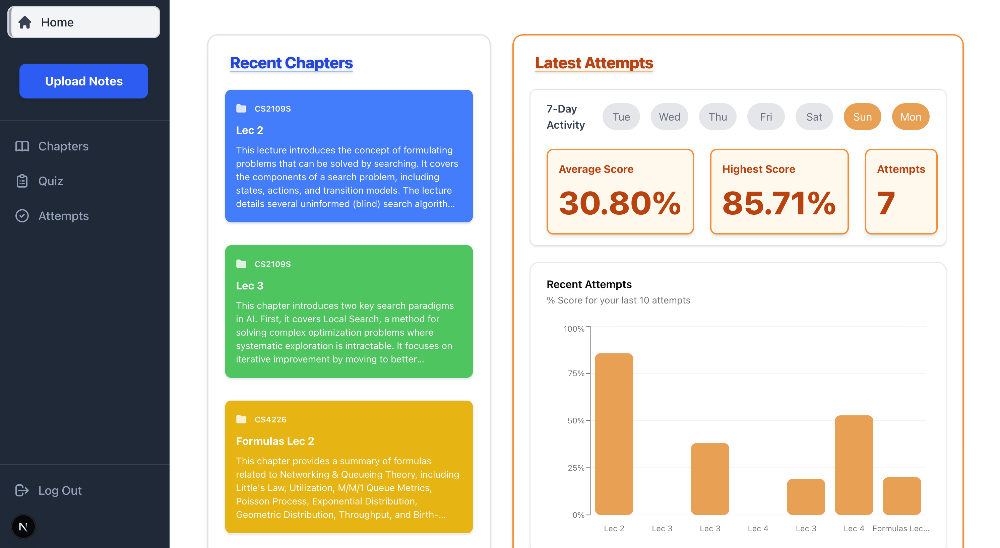
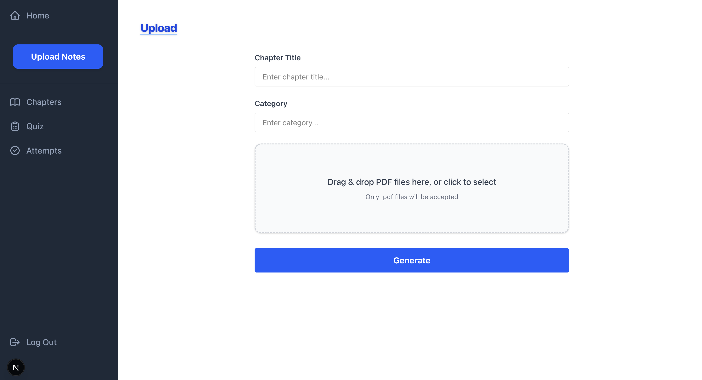
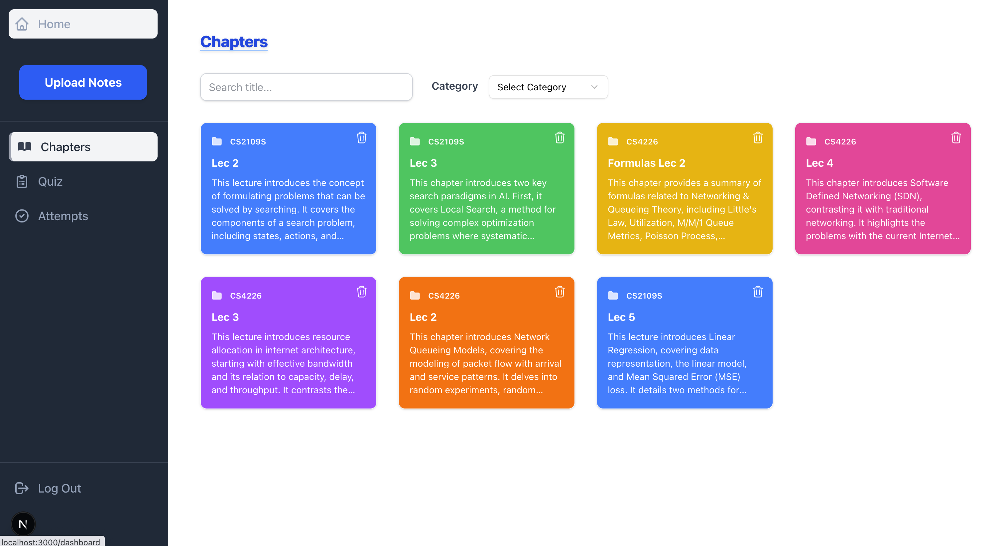
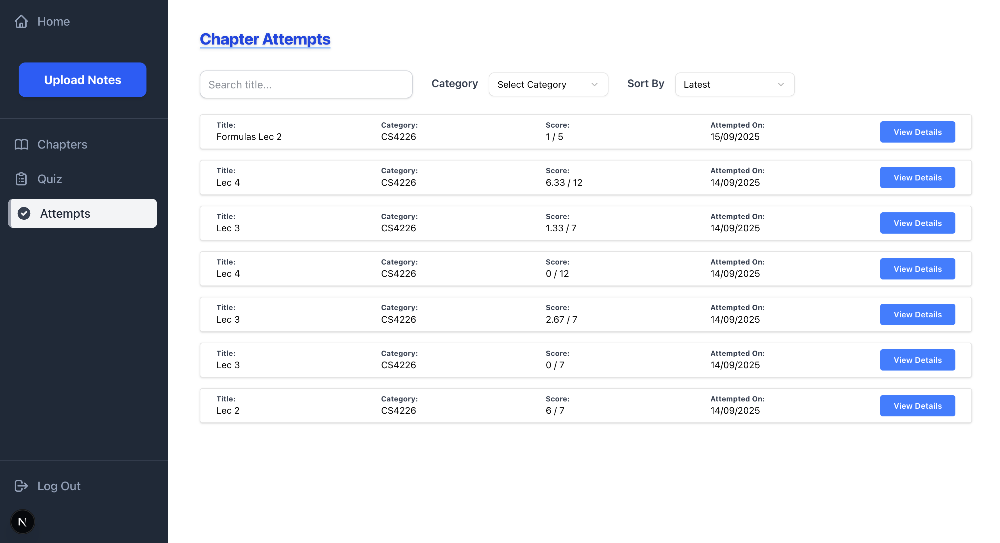
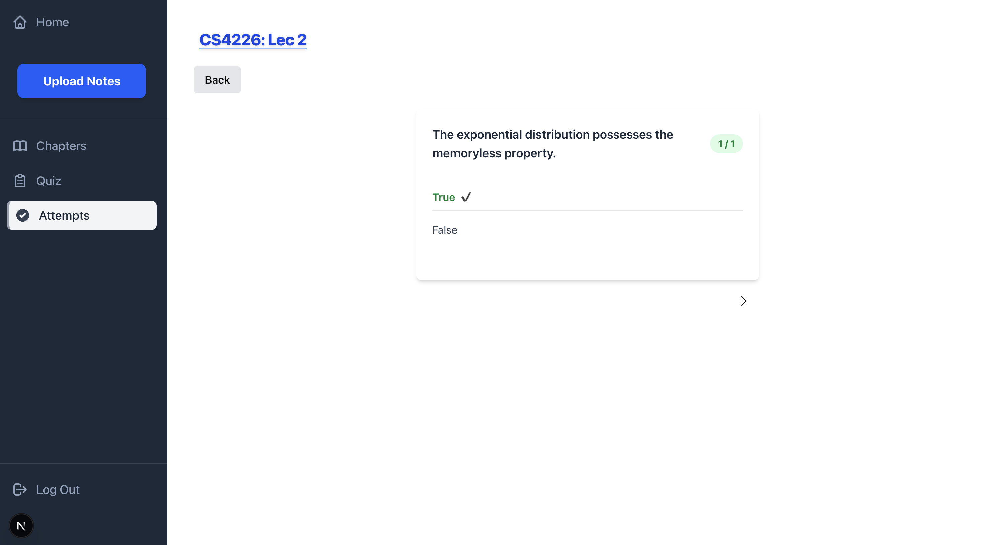
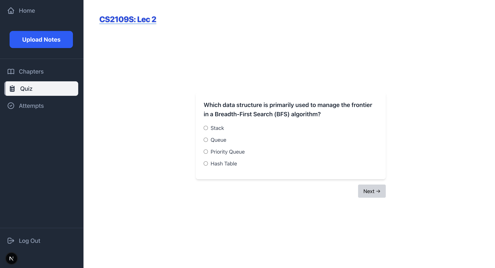
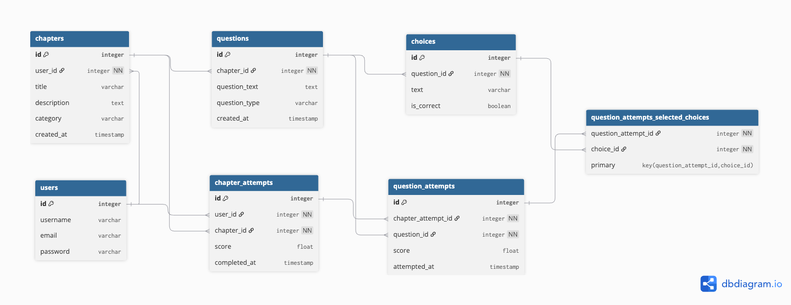

# TestMeGemini

Turn your notes into interactive quizzes and track your learning progress.

## Features

- **User Authentication**  
  Secure authentication with **JWT tokens** and **email login**, ensuring safe access to your account.

- **Upload Notes & Auto-Generate Questions**  
  Upload your study notes in **PDF Format** and automatically generate questions in multiple formats:

  - **MCQ (Multiple Choice Questions)**
  - **MRQ (Multiple Response Questions)**
  - **True/False**

- **Create Chapters and Questions**  
  Organize your content efficiently by creating chapters and questions for quizzes and study material.

- **Take Quizzes & Track Attempts**  
  Test your knowledge with interactive quizzes. Review answers, monitor progress, and analyze performance over multiple attempts.

- **Dashboard with Analytics and Charts**  
  Gain insights into your learning progress through detailed analytics, including charts and performance metrics.

## Upcoming Features

- Support Category creation
- An Analytics page for detailed insights and reporting.
- Asynchronous chapter and question generation powered by Celery for improved performance.
- Notes summary generator

## Screenshots

**Login**



**HomePage / Dashboard**



**Upload PDFs**



**Chapters List**



**Chapter Attempts**



**In Attempt (Question View)**



**In Quiz (Answering)**



## Installation & Local Development

### Environment Variables

- Backend: Create .env under backend/ and set `GEMINI_API_KEY` to your Gemini API Key
- Frontend: Create .env under frontend/ and set `NEXT_PUBLIC_API_URL` to your API URL (backend)

### Using the Makefile (Recommended)

All common setup and run commands are available via the Makefile at the project root. Run these from the project root directory:

#### For full list of commands

```bash
make help
```

#### 1. Install dependencies (backend & frontend)

```bash
make backend-install
make frontend-install
```

#### 2. Run migrations (auto-detects model changes)

```bash
make backend-migrate
```

#### 3. Start the development servers (in separate terminals)

```bash
make backend-run
make frontend-run-dev
```

#### 4. Build for production

```bash
make frontend-build
make frontend-run-prod
```

## Architecture Overview

- **Architecture:** Single Page Application
- **Backend:** Django REST Framework, JWT Auth, OpenAI integration for question generation.
- **Frontend:** Next.js (App Router), React, Tailwind CSS, shadcn/ui, Recharts for charts.
- **Database:** SQLite (default, can be swapped for Postgres/MySQL)
- **Database Modelling**: 

## Model Choice & Cost Comparison

The application uses a Gemini fallback chain for AI generation:

1. Try gemini-2.5-pro first for best reasoning and summary quality.
2. If it returns transient overload / 503 after limited retries, fall back to gemini-2.5-flash.
3. If Flash also overloads, fall back to gemini-2.5-flash-lite (fastest / cheapest) to still return something.
4. If all three fail, a clear error is returned.

Only text input/output is currently used (no image/video/audio responses stored), but full multimodal support is available in all three Gemini 2.5 models.

### Text Pricing (USD per 1M tokens, August 2025)

(Shows standard vs batch where relevant; Flash Lite & Flash have same rate ≤ / > 200K for text.)

| Model                 | Input ≤200K | Input >200K | Output Text (≤200K→>200K) | Batch Input ≤200K | Batch Input >200K | Batch Output (≤200K→>200K) | Max Input Tokens | Max Output Tokens | Notes                            |
| --------------------- | ----------- | ----------- | ------------------------- | ----------------- | ----------------- | -------------------------- | ---------------- | ----------------- | -------------------------------- |
| gemini-2.5-pro        | $1.25       | $2.50       | $10 → $15                 | $0.625            | $1.25             | $5.00 → $7.50              | 1,048,576        | 65,535            | Highest quality / deep reasoning |
| gemini-2.5-flash      | $0.30       | $0.30       | $2.50 (flat)              | $0.15             | $0.15             | $1.25 (flat)               | 1,048,576        | 65,535            | Balanced cost/speed              |
| gemini-2.5-flash-lite | $0.10       | $0.10       | $0.40 (flat)              | $0.05             | $0.05             | $0.20 (flat)               | 1,048,576        | 65,536            | Lowest cost / fallback & bulk    |
| gpt-4o-mini (ref)     | $0.50       | $0.50       | $1.50                     | –                 | –                 | –                          | 128,000          | ~16,000+          | Alternative; polish tradeoff     |

### Rationale

- Pro delivers best structured summaries & nuanced distractors for MCQ/MRQ.
- Flash handles the majority of volume cheaply when Pro is temporarily busy.
- Flash Lite ensures resilience under sustained platform load (keeps user flow unblocked).
- Gemini chosen for this personal project because of a generous free usage tier → near-zero iteration cost while prototyping; GPT kept as an easy swap path.

### Observability

- The service adds an internal `_model_used` field for downstream logging/analytics.
- Fallback & retry logic lives in `backend/api/utils/ai.py` (`call_gemini_model`). Adjust order via `MODEL_CHAIN`.

## License

MIT
